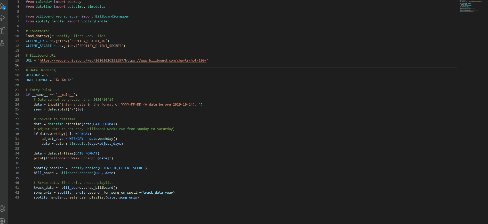

# Bill-ify - Generate a spotify playlist from Billboard top 100

Generate a spotify playlist for Billboards top 100 for a week ending.
Constraints: This project uses a archive link to ensure consistency, therefore you cannot generate a playlist for a week greater than 2020-10-14.

</img>



Overview: 
--------
* main.py is the entry point to run the program.
* Billboard webscraper handles the web scrapping using bs4. 
* Spotify handler is responsible for talking to spotify apis through spotipy.
    * You will need your own account for this, and will need to verify it ont he first run.
    * Songs are matched on a process of try and catch. 
        1. Search for URI on track name and artist name, 
        2. Search for URI on track name and year,
        3. Search for URI on track name only
        * if no song is found it is not added to the playlist.
    * Once Songs are found the playlist is created.


## Users of this package:
-------------------------
Since the website changes very frequently a decsion was made to use a snapshot from the Internet Archive's Wayback machine [here](https://web.archive.org/web/20201026231157/https://www.billboard.com/charts/hot-100/)

To use this package you will need to create a spotify developer account and app. https://developer.spotify.com/dashboard/ 

The ClientID and ClientSecret will need to be added to the constant variables through either direct assignment or environment variables. You can use a .env file with the same names as the constants in main.py for this to work. 

The .env file
-
Contents of .env file:
```
SPOTIFY_CLIENT_ID=your_id
SPOTIFY_CLIENT_SECRET=your_secret
```

